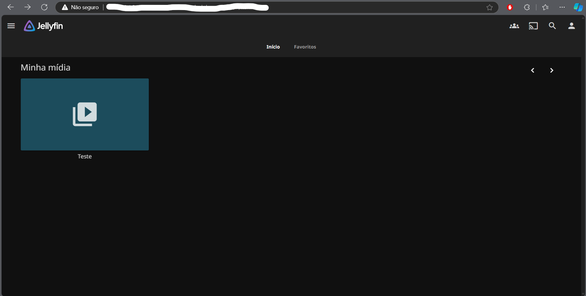
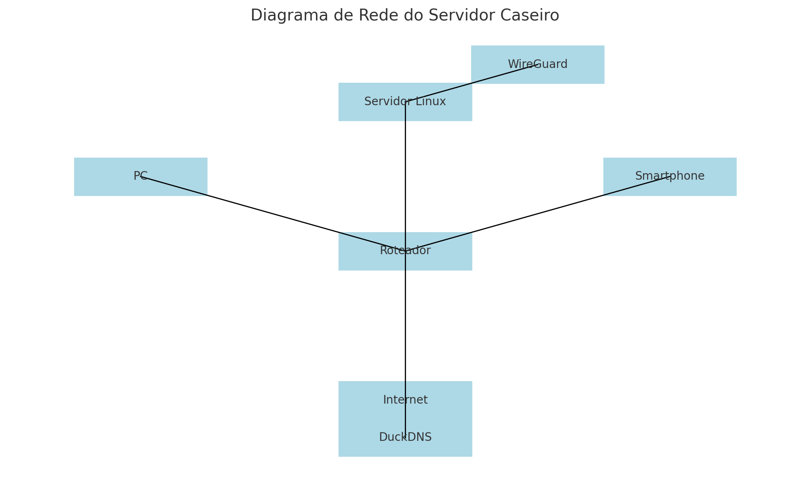

# Servidor Doméstico Completo com Linux: Multimídia, VPN e Rede com DNS Dinâmico

Transformei um notebook antigo em um servidor caseiro completo com Linux, configurado para atender a várias necessidades de rede, streaming de mídia e acesso remoto seguro. Este projeto foi uma oportunidade prática para aprimorar habilidades de administração de sistemas e configuração de redes, e mostrou-se uma solução eficaz e de baixo custo para centralizar serviços em um ambiente doméstico.

## Principais Configurações

### Sistema Operacional
- **Linux Server**: Optei pelo Linux Server, que oferece estabilidade e permite uma operação contínua e eficiente em hardware de baixo custo.

### Serviços Implementados

- **Samba**: Compartilhamento de arquivos na rede local, proporcionando fácil acesso aos arquivos em diversos dispositivos.
- **Jellyfin**: Plataforma de streaming de mídia que organiza e transmite conteúdo de vídeo e áudio para dispositivos conectados.
- **WireGuard VPN**: Acesso remoto seguro, permitindo conexões criptografadas ao servidor, mesmo fora da rede doméstica.
- **DuckDNS**: DNS dinâmico, permitindo que o servidor seja acessado por um endereço estável, mesmo com IP dinâmico. Facilita o uso do WireGuard VPN de qualquer lugar.
- **Configuração de Energia**: Para assegurar a disponibilidade contínua do servidor, configurei o sistema para ignorar a função de hibernação ao fechar a tampa do notebook, permitindo que os serviços permaneçam ativos a todo momento.
- **Port Forwarding e Acesso Remoto**: Configurei o roteador para redirecionamento de portas, facilitando o acesso remoto via SSH e VPN com segurança reforçada para proteger os dados e o servidor.

## Principais Aprendizados

Este projeto foi uma excelente oportunidade para desenvolver competências em:
- **Administração de sistemas Linux**
- **Segurança de rede**
- **Configuração de DNS dinâmico (DDNS)** com DuckDNS

## Imagens

*Jellyfin configurado e em funcionamento.*

*Diagrama do projeto mostrando a configuração geral.*

## Tecnologias Utilizadas
- **Servidor Linux**
- **Redes**
- **VPN (WireGuard)**
- **Domain Name System (DNS)**

---

**Tags**: #Linux #DevOps #VPN #Redes
